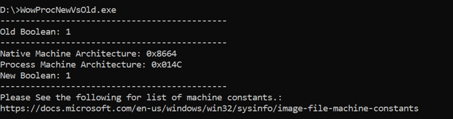
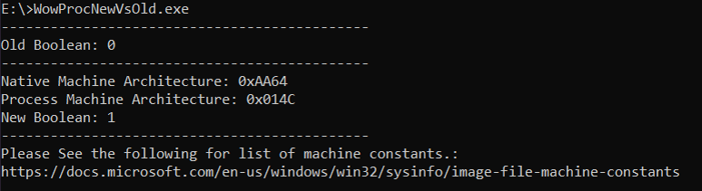

# WowProcNewVsOld
Simple app to show how [IsWow64PRocess](https://docs.microsoft.com/en-us/windows/win32/api/wow64apiset/nf-wow64apiset-iswow64process) differs from [IsWow64Process2](https://docs.microsoft.com/en-us/windows/win32/api/wow64apiset/nf-wow64apiset-iswow64process2) when executed against the current process. 

## When Run on x64:

## When Run on ARM64:

## Machine Constants Reference:
Hex Values of machine types defined can be found in https://docs.microsoft.com/en-us/windows/win32/sysinfo/image-file-machine-constants.
